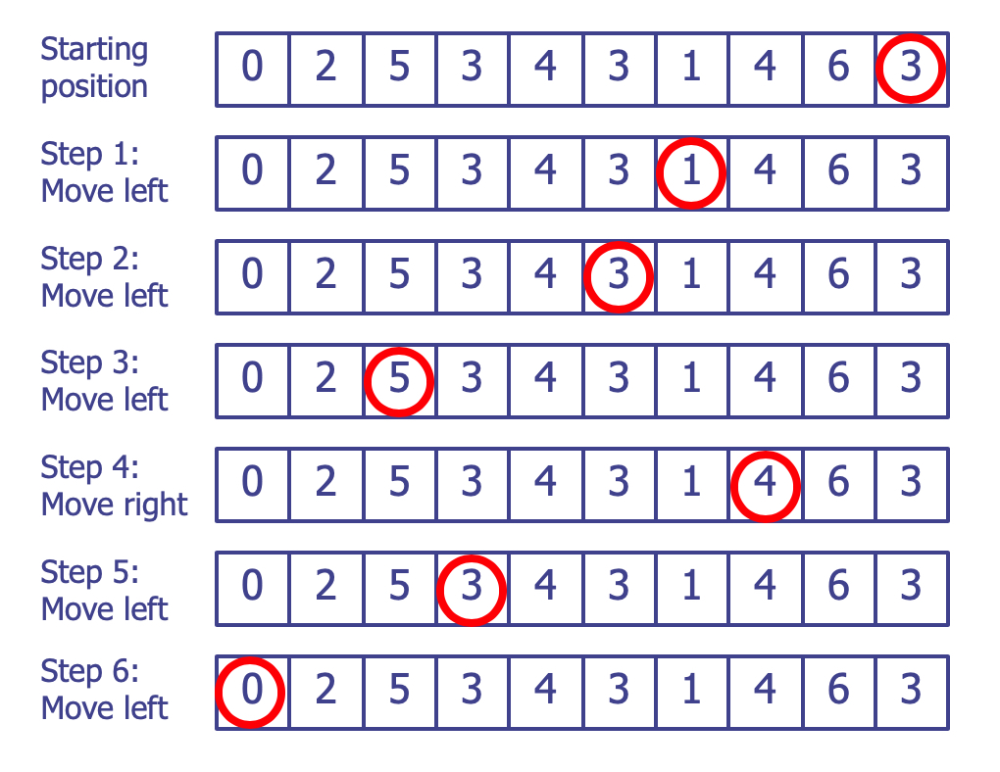

## Homework #4

**Due: May 10 (Friday)**

### Problem 1: Fibonacci (Tail Recursion)

Complete a tail recursive function for fibonacci.

```java
public class Fibonacci {
  /**
   * Iterative version of Fibonacci number generator.
   * 0, 1, 1, 2, 3, 5, 8, 13, 21, ...
   *
   * @param n the index of the Fibonacci number starting from 0
   * @return the n-th Fibonacci number
   */
  public static int fibIter(int n) {
    if (n <= 1)
      return n;

    int acc = 1;
    int prev = 0;

    while (n-- > 1) {
      int temp = acc;
      acc += prev;
      prev = temp;
    }
    return acc;
  }

  /**
   * Public API for tail-recursive version of the Fibonacci number generator.
   * 0, 1, 1, 2, 3, 5, 8, 13, 21, ...
   *
   * @param n the index of the Fibonacci number starting from 0
   * @return the n-th Fibonacci number
   */
  public static int fib(int n) {
    return fibTailRec(n, 1, 0);
  }

  /**
   * Tail-recursive version of Fibonacci number generator.
   * This method is private and should not be called directly.
   * Use {@link #fib(int)} instead.
   * 0, 1, 1, 2, 3, 5, 8, 13, 21, ...
   *
   * @param n       the index of the Fibonacci number starting from 0
   * @param current the current Fibonacci number
   * @param prev    the previous Fibonacci number
   */
  private static int fibTailRec(int n, int current, int prev) {
    /*
     * Complete codes here ...
     */
    return 0; // remove this line
  }

  public static void main(String... args) {
    // These two print statements should print the same result.
    System.out.println(
            Arrays.toString(IntStream.rangeClosed(0, 20).map(Fibonacci::fibIter).toArray())
    );

    System.out.println(
            Arrays.toString(IntStream.rangeClosed(0, 20).map(Fibonacci::fib).toArray())
    );
  }
}
```

### Problem 2: Pig Latin

Pig Latin is mainly used in fun. It is also used by children or young adults
to hide conversation from older people. For example, a conversation between
two people in the presence of an unwanted other may consist of:

    "ehay isay eryvay illysay" = "he is very silly".


#### Rules:

1. For words that begin with consonant sounds, all letters before the initial
   vowel are placed at the end of the word sequence. Then, "ay" is added, as in
   the following examples:

```python
    "pig" = "igpay"
    "latin" = "atinlay"
    "banana" = "ananabay"
    "happy" = "appyhay"
    "duck" = "uckday"
    "me" = "emay"
    "too" = "ootay"
```

2. For words that begin with vowel sounds, one just adds "ay" to the end:

```python
    "eat" = "eatay"
    "omelet" = "omeletay"
```

Write a tail-recursive function `toPigLatin` which translates a word given
in `String` to the corresponding pig latin word.


```java
public class PigLatin {
    static List<Character> vowels = Arrays.asList('a', 'e', 'i', 'o', 'u');

    /**
     * Convert a word to Pig Latin
     *
     * @param input the word to convert
     * @return the word in Pig Latin
     */
    public static String toPigLatin(String input) {
        /*
         * Complete codes here ...
         */
        return null; // remove this line
    }

    public static void main(String[] args) {
        List<String> words = List.of("pig", "latin", "smile", "string", "eat");

        System.out.println(words.stream()
                .map(PigLatin::toPigLatin)
                .collect(Collectors.toList()));
    }
}
```

### Problem 3: Box 

아래 그림과 같이 integer를 포함하고 있는 box로 구성된 퀴즈 문제를 고려해 봅시다.

<div style="text-align: center;"></div>

마지막 box의 원은 좌우로 이동할 수 있는 marker입니다. 매 단계마다, box 안에 있는 숫자 만큼
왼쪽 또는 오른쪽으로 이동시킬 수 있지만, 맨 앞 또는 맨 뒤의 box를 벗어나서는 안됩니다.

위 그림을 예로 들면, 현재 원의 위치에서는 오른쪽으로 이동 할 수 없기 때문에 왼쪽으로 세 칸 이동하는 것 만이 유일한 방법입니다.
이 퀴즈의 목적은 원을 맨 왼쪽 0이 들어 있는 box로 이동 시키는 것이 가능한지를 판단하는 것입니다.
위의 그림에서 시작한다면 아래 그림과 같은 순서로 이동하여 도달하는 것이 가능합니다.

<div style="text-align: center;"></div>

예제로 주어진 문제에서는 해결 방법이 존재 (단, 다른 가능한 이동 방법도 여럿 존재 할 수 있음) 하지만,
다음 그림과 같이 주어진다면, 목적지에 도달하기 위한 방법이 존재하지 않을 수도 있습니다.

<div style="text-align: center;"></div>

이 그림에서는 두 3 사이에서 쳇바퀴 돌 뿐, 다른 box로의 이동이 불가하게 됩니다.

Integer array (boxes)가 주어졌을 때, 주어진 시작 위치(default index: `length - 1`)에서 목적지(default index: 0, `0`이 들어 있는 box)에
도달 할 수 있는 지의 여부를 판단하는 method를 작성하십시요. 시작 위치와 목적지의 위치는 각각 맨 오른쪽과 왼쪽으로 고정되어 있으나, 
Box 생성시 시작 위치와 목적지의 위치를 변경할 수 있습니다.

box에 포함되는 숫자 `x` 는 `0`을 갖는 목적지 box를 제외하고 `0 < x < boxes.length`라고 가정하기 바랍니다.

**(주의) 함수가 수행되는 동안된 box안의 숫자가 바뀌어서는 안됩니다!**

```java
public class Box {
    /**
     * Default target index
     */
    private static final int DEFAULT_TARGET_INDEX = 0;

    /**
     * Puzzle Boxes
     */
    private int[] boxes;

    /**
     * Starting index: default source index is the last index of the `boxes`.
     * Target index: default target index is the first index of the `boxes`.
     */
    private int startIndex;
    private int targetIndex = DEFAULT_TARGET_INDEX;

    /**
     * Flag(s) to check if a move to the left or right from a given box was
     * tried before
     */

    /*
     * Define necessary private variable(s) here ...
     */

    /**
     * Constructor for the puzzle using default start and target indexes.
     *
     * @param size the size of the puzzle box in terms of the number of boxes
     * DO NOT MODIFY THIS CONSTRUCTOR
     */
    public Box(int size) {
        this(size, size - 1, DEFAULT_TARGET_INDEX);
    }

    /**
     * Constructor for the puzzle using specified indexes.
     *
     * @param size   the size of the puzzle box in terms of the number of boxes
     * @param start the starting index
     * @param target the target index
     * DO NOT MODIFY THIS CONSTRUCTOR
     */
    public Box(int size, int start, int target) {
        startIndex = start;
        targetIndex = target;
        getBuckets(size, new Random(System.currentTimeMillis()));
    }


    /**
     * Generate random values for the puzzle boxes
     *
     * @param size the size of the puzzle box in terms of the number of boxes
     * @param gen  the random number generator
     * DO NOT MODIFY THIS METHOD
     */
    private void getBuckets(int size, Random gen) {
        boxes = new int[size];
        for (int i = 0; i < size; i++) {
            int value = 0;
            // Get next value while ignoring zero
            while ((value = Math.abs(gen.nextInt())) % size == 0)
                ;
            boxes[i] = value % size;
        }
        boxes[targetIndex] = 0; // Final target value is always set to 0.

        initFlags(size);
    }

    /**
     * Initialize the flag(s) for the puzzle
     *
     * @param size the size of the puzzle box in terms of the number of boxes
     */
    private void initFlags(int size) {
        /*
         * Complete codes here ...
         */
    }

    /**
     * Core of the puzzle. Move current index to the next index based on the value of the current index.
     *
     * @param current current index
     * @return true if the puzzle is solved, false otherwise
     */
    public boolean move(int current) {

        /*
         * Complete codes here ...
         */

        return false;
    }

    /**
     * Start the puzzle
     *
     * @return true if the puzzle is solved, false otherwise
     * DO NOT MODIFY THIS METHOD
     */
    public boolean start() {
        return move(startIndex);
    }

    /**
     * Get the boxes. Debugging purpose only.
     *
     * @return the boxes
     * DO NOT MODIFY THIS METHOD
     */
    public int[] getBoxes() {
        return boxes;
    }

    /**
     * Constructor for the puzzle using the specified boxes.
     * The start and target indexes are the last and the first indexes of the boxes, respectively.
     * This constructor is used for testing purposes only.
     *
     * @param buckets the boxes
     * DO NOT MODIFY THIS METHOD
     */
    public Box(int[] buckets) {
        this(buckets, buckets.length - 1, DEFAULT_TARGET_INDEX);
    }

    /**
     * Constructor for the puzzle using the specified boxes and indexes.
     * This constructor is used for testing purposes only.
     *
     * @param buckets the boxes
     * @param start  the starting index
     * @param target  the target index
     * DO NOT MODIFY THIS METHOD
     */
    public Box(int[] buckets, int start, int target) {
        this.boxes = buckets;
        startIndex = start;
        targetIndex = target;

        initFlags(buckets.length);
    }

    /**
     * Constructor for the puzzle using default start and target indexes.
     * This constructor is used for testing purposes only.
     *
     * @param size the size of the puzzle box in terms of the number of boxes
     * @param gen  the random number generator
     * DO NOT MODIFY THIS CONSTRUCTOR
     */
    public Box(int size, Random gen) {
        this(size, size - 1, DEFAULT_TARGET_INDEX, gen);
    }

    /**
     * Constructor for the puzzle using specified indexes and random number generator.
     * This constructor is used for testing purposes only.
     *
     * @param size   the size of the puzzle box in terms of the number of boxes
     * @param start the starting index
     * @param target the target index
     * @param gen    the random number generator
     * DO NOT MODIFY THIS CONSTRUCTOR
     */
    public Box(int size, int start, int target, Random gen) {
        startIndex = start;
        targetIndex = target;
        getBuckets(size, gen);
    }

    public static void main(String... args) {
        Box puzzle = new Box(5);
        System.out.println(Arrays.toString(puzzle.getBoxes()));
        System.out.println(puzzle.start());

        Box puzzle2 = new Box(5, 0, 4);
        System.out.println(Arrays.toString(puzzle2.getBoxes()));
        System.out.println(puzzle2.start());

        Box puzzle3 = new Box(5, new Random(1569));
        System.out.println(Arrays.toString(puzzle3.getBoxes()));
        System.out.println(puzzle3.start());

        Box puzzle4 = new Box(5, new Random(1569));
        System.out.println(Arrays.toString(puzzle3.getBoxes()));
        System.out.println(puzzle4.start());
    }
}
```

#### Implementation Guidelines

- You can freely modify the body of each method to complete the code. You can also freely
add `private` fields and methods if necessary. **However, no given `public` method signatures should be changed**.
- You should check the correctness of your program by running test code, `Homework4Test.java`

### What to submit?

- Your source codes archived in `.zip` or `.jar` format.
    - Subject: Homework#4, Section [A|B], 성명, 학번
    - Email to your TA (김정인, rkrkrk24@hanyang.ac.kr)
